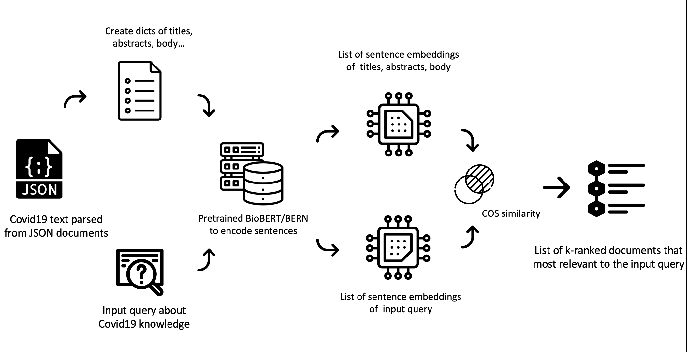
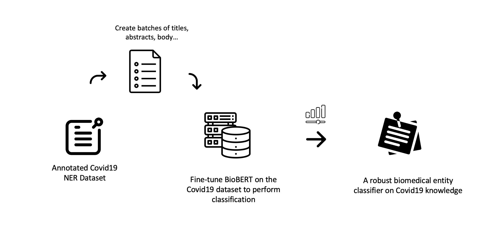

# COVID19 Knowledge Representation and Search Engine
## 📌 Submission to The 2021 Imperial College Data Science Challenge

In response to the COVID-19 pandemic, [2021 Data Science Institute Natural Language Processing Challenge](https://www.imperial.ac.uk/data-science/) issued a call to action for researchers to apply text mining approaches to keep up with the exponential growth of coronavirus literature. Our goal is to is to retrieve biomedical information and construct knowledge graphs based on semantic representation.

<!-- ABOUT THE PROJECT -->
<h2 id="about-the-project"> :pencil: About The Project</h2>

**Semantic Search** and **Named Entity Recognition** tasks were carried out by finetuning BioBERT. The extracted entities and relationships from the titles and abstracts of the literature eventually contributed to the building of the Covid 19 knowledge graph.

Semantic Search Engine Workflow     [`notebook`](./notebooks/Covid19_Search_Engine_BioBERT.ipynb)

Named Entity Recognition Workflow   [`notebook`](./notebooks/Covid19_NER_BioBERT.ipynb)

## Dataset
[COVID-19 Open Research Dataset (CORD-19)](https://github.com/allenai/cord19) is a corpus of academic papers about COVID-19 and related coronavirus research. It's curated and maintained by the Semantic Scholar team at the Allen Institute for AI to support text mining and NLP research. 

## Prerequisites

  

<!--This project is written in Python programming language.  -->
The following are the major open source packages utilised in this project:
* NLTK
* SpaCy
* Matplotlib
* Scikit-Learn
* Pytorch
* TensorFlow
* Keras

<h2 id="folder-structure"> Folder Structure</h2>

    code
      .  
      ├── notebooks                                                       
      │    ├── Covid19_Search_Engine_BioBERT.ipynb                   
      │    ├── Covid19_NER_BioBERT.ipynb   
      │    └── README.md    
      │    
      │
      └── src
            ├── 0_parse_the_data                        # Part 0 : Parse the Data                                  
            │   ├── parse_the_data.py                   # extract document titles and abstract, output > bio_titles.txt
            │   └── README.md    
            │
            ├──  1_tokenization                          # Part 1 : Tokenization    
            │     ├── tokenization.py                    # tokenized the text by creating top100k token list, output > *_tokens.txt 
            │     ├── tokenizer-bio.json                  
            │     ├── split_tokens.txt
            │     ├── bpe_tokens.txt
            │     ├── nltk_tokens.txt
            │     ├── scispacy_tokens.txt
            │     ├── bert-base-uncased-vocab.txt
            │     └── README.md    
            │
            ├── 2_word_representation                   # Part 2 : Build Word Representations             
            │   ├── n-gram                              
            │   │   ├── n_gram.py                       # create word embedding through n-gram
            │   │   ├── n_gram_word2id.txt             
            │   │   └── README.md 
            │   │
            │   └── skip_gram                           
            │       ├── skip_gram.py                    # create word embedding through skip-gram
            │       ├── new_w2v.model                   # skip-gram model
            │       └── README.md
            │
            ├── 3_visualise_word_representation         # Part 3 : Explore the Word Representations                    
            │   ├── t_sne.py                            # visualised embeddings through t-sne, output > t_sne.png
            │   ├── bio_t_sne.py  
            │   ├── co-occurrence.py                    # find entities that co-occur with Covid 19, output > co-occurrence.csv
            │   ├── co-occurrence.csv                   # co-occurrence output 
            │   ├── semantic_sim.py                     # find entities that semantically similar with Covid 19, output > semantic_sim.txt
            │   ├── semantic_sim.txt
            │   ├── bio_dict                            # dict of biomedical entities for mapping
            │   └── README.md    
            . 

## 🎯 RoadMap

Follow [end-to-end notebooks](./notebooks) in Google Colab 

`./src` is the submission source code in Pytorch

## Future Work
Create Neo4j knowledge graphs for coronavirus literatures.

## Contributing
If you have any questions or suggestions towards this repository, feel free to contact me at xy2119@ic.ac.uk.

Any kind of enhancement or contribution is welcomed!
